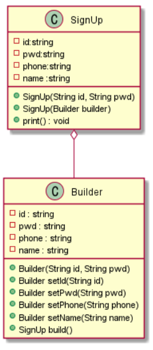
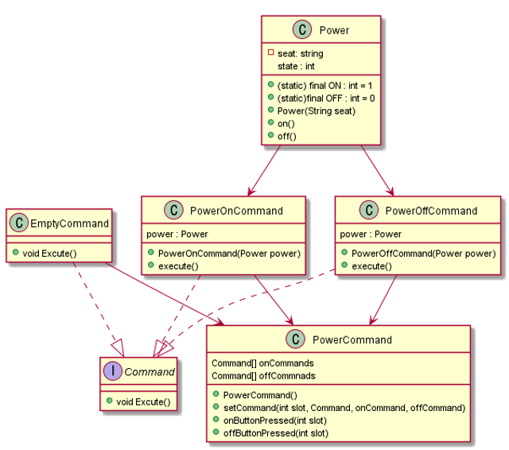
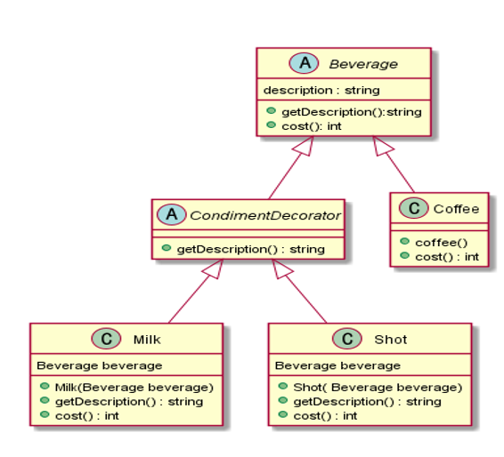
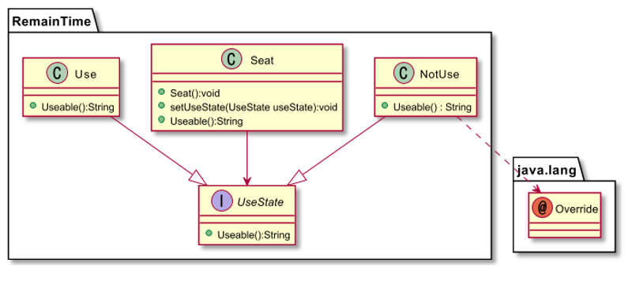
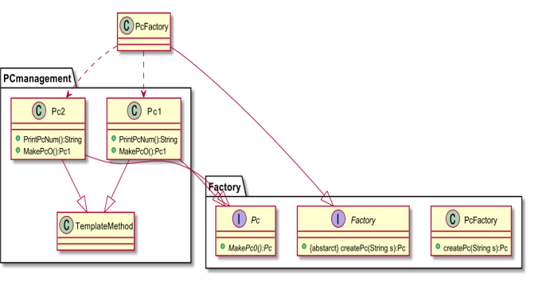
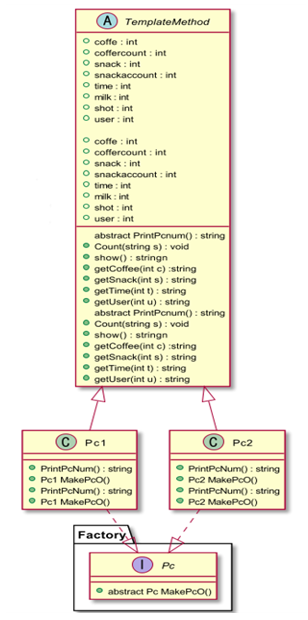

# PC방 좌석 관리 시스템

## 개요

디자인 패턴이 적용될 수 있는 ‘PC방 관리 시스템’이라는 소프트웨어 시스템을 구축하고, 개발 과정 및 테스팅 절차를 준수하여 품질 향상 및 유지보수 시, 발생하는 문제를 예방하는 능력을 배양하는 데 그 목적이 있다.

## 개발 환경
```
* Language : Java
* Platform : NetBeans 11.3
* DB : NotePad
* Tools : JAVA SWING
```

서비스의 주요 기능은 다음과 같다  
가. 관리자  
● 고객 관리  
● 매출 정산  
● PC 관리  

나. 고객  
● 잔여 시간 확인  
● 요금 확인  
● 주문 내역 확인  

## 디자인 패턴
### Builder 패턴
 
  
#### 문제점  
과도하게 많은 멤버변수가 존재해 생성자를 사용하였을 때, 정보가 맞게 입력되었는지 알아보기 힘들고, 코드의 가독성이 떨어진다.

#### 해결방안
빌더 클래스를 static으로 생성한다. 빌더 클래스 생성자는 public으로 하여 필수 값들에 대해 생성자의 파라미터로 받는다. 빌더 클래스는 각 멤버변수에 set메서드를 할당해 멤버변수의 값을 변경하고 다시 빌더 객체를 반환한다. 반환한 빌더 클래스는 build() 메서드가 호출될 경우 SignUp을 반환해 객체를 생성해준다.

### Command 패턴
  
#### 문제점  
전체 컴퓨터의 전원 관리가 아닌 각 좌석 마다의 컴퓨터 제어가 필요했고, 제어를 위해 구체적인 구현 사항들을 클라이언트가 알아야만 한다. 

#### 해결방안
각 좌석의 컴퓨터 전원을 켜고 끄는 명령어를 인보커에 등록하고, 상황에 맞춰 언제든지 인보커로 간단하게 실행시켜 클라이언트가 구체적인 구현 사항을 알 필요가 없다.

### Decorator 패턴
  
#### 문제점  
음료 주문 시, 추가할 재료들을 모두 클래스로 구현 한다면, 많은 클래스가 필요한데, 이 구조는 상당히 비효율 적이다.

#### 해결방안
간단한 샷과 우유를 추가 할 수 있게 CondimentDecorator 추상 클래스를 생성하여 샷과 우유를 서브 클래스로 지정하였고 커피 클래스는 Beverage 클래스에 받고 CondimentDecorator 클래스도 Beverage 클래스에 상속 받는다. 그리고 사용하는 PC에서 커피를 주문 받을 수 있게 TemplateMethod에서 다중 상속을 받는다.

### State 패턴
  
#### 문제점  
객체들은 종종 상태에 따라 행동을 변화시킬 필요가 있는데 이 때 가장 간단한 방법이 if/else, switch 문인데, 이런 구조는 상태 테이블을 변화시키거나 새로운 상태를 추가하기 어렵게 되며, 새로운 상태가 추가된다면 많은 메서드를 변경해 주어야 한다. 즉, 유지보수하기 어려운 구조를 가지게 된다.

#### 해결방안
UseState 클래스를 인터페이스로 정의하고 PC좌석 사용중일 때 사용할 Use클래스로 구현하고 PC좌석을 사용중이지 않을 때는 NotUse클래스로 구현한다. MinForm.java에서 상태를 객체화 하여 행동에게 위임 한다.

### Factory 패턴
  

#### 문제점  
PC방 특성 상 컴퓨터가 매우 많고, 이 컴퓨터들의 객체를 일일이 생성하는 것은 소스코드 자원의 낭비일 뿐만 아니라 각 PC마다 주문 내역과 충전 시간이 다르기 때문에 객체의 상태가 서로 달라야 한다.

#### 해결방안
객체를 생성하는 공장을 만들어 주는 FactoryMethod 패턴을 통해 문제를 해결한다.
 해당 패턴을 사용하여 객체만 생성하는 공장을 통해 객체를 생성하고, 인터페이스를 정의하되, 
실제 구현내용은 자식클래스에서 구현이 되도록 하여 결합도를 낮추고, 객체 간의 결합도를 낮춘다는 말은 곧 유지보수가 용이하게 된다는 결과를 나을 수 있다.

### Template Method 패턴
  

#### 문제점  
각 PC 자리 마다 시간 추가, 음식주문 등 적용되는 기능이 모두 같기 때문에 각 PC 자리 마다 다르게 클래스를 생성해서 구현하면 소스코드 길이가 늘어날 뿐만 아니라 유지 보수하기에 어렵다.

#### 해결방안
각 PC자리에 공통되는 기능을 캡슐화 하여 상위 클래스에 정의하고,
하위 클래스에서 달라지는 부분 즉 PC자리 번호를 재정의하는 방법을 사용한다.

## 시연 영상 및 발표 영상
[](https://youtu.be/22AVF2PN9Mo)  
